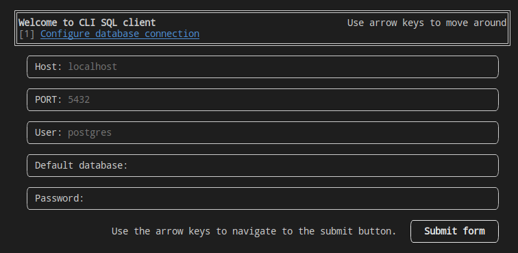
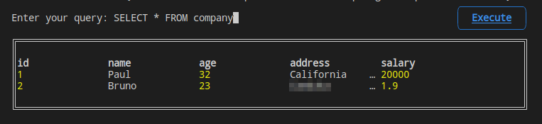

# pgcli

An interactive terminal to execute queries with the PostgreSQL database. (experimental)

Install deps

```
npm install
```

Build

```
npm run build
```

Link globally

```
npm link
```

Using globally

```
pgcli
```

or localy

```
npm run start
```

<!-- markdown image -->




